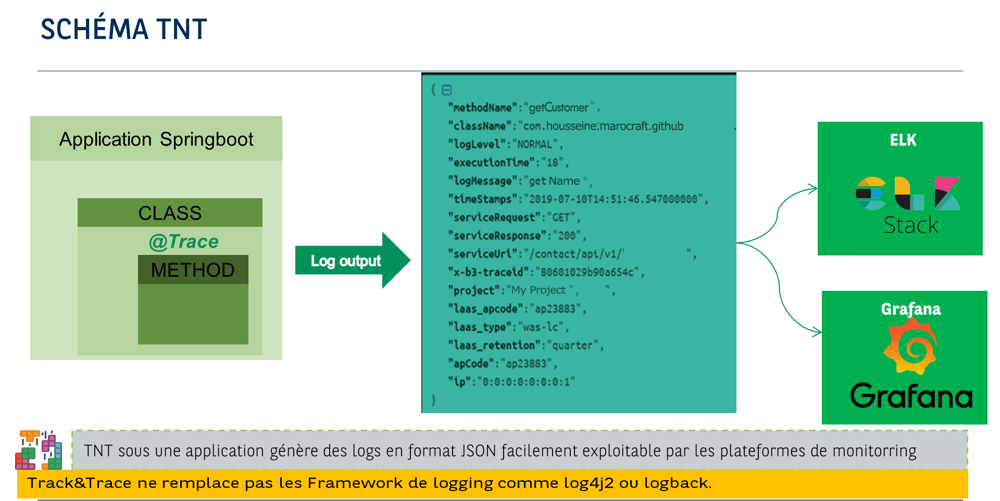
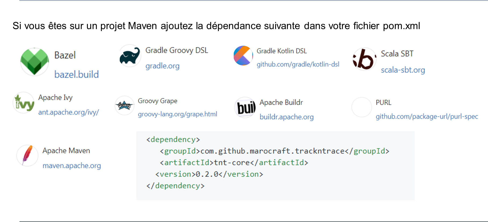
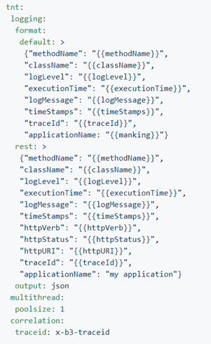
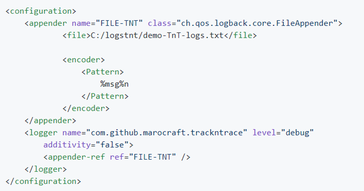

# Documentation TnT

## Introduction

### Pain points

On a tous eu l'occasion de consulter des logs soit pour chercher la cause d’une exception ou juste pour s’assurer que le output d’une application est le même avec ce qu’on attendais;
Alors imaginons une situation: on est en plein prod tout va bien on est comptant soudain l’application s’explose, les appelles commencent et on est bloqué, alors si les ops ont une plateform de monitoring ils doivent consulter les logs de chaque développeur parcequ’ils a eu du mal à agréger les logs de l’ensemble des développeurs parce que chaque développeur écrit les logs à ca manière  donc beaucoup plus de temps et de stress pour localiser l’anomalie et  c’est une tache pénalisante.

Les développeurs de leur côté écrivent les logs mannuellement: pour chaque méthode d’une class  on doit écrire du code pour avoir des logs ce qui signifie encore plus de temps de dev.

Pour résumer ces points:

- Écrire les logs techniques manuellement est une tâche répétitive et lourde

- Chacun écrit les logs à sa manière

- Difficulté de centraliser le format des logs

- Complexité d’interfaçer les logs avec une plateforme de monitoring telle que la Stack ELK

### Solution

C’est effectivement pour les Pain points déclarés en decus que nous avons pensé à créer mécanisme simplifié, unifié de logging facilement plugable dans des application java basées sur spring boot qui facilite la tache pour les développeur et les ops.

On peut le considérer comme un contrat entre eux.

## Schéma TnT

Voici un schéma qui explique le fonctionnement du framework TnT

&nbsp;

 Techniquement parlant, ceux sont des annotations ciblant les différentes couches applicatives avec un comportement adapté selon leurs types et manières d’utilisation.
Le Framework ne remplace pas les Framework de logging comme log4j2 ou logback.Par contre il permet de s’interfacer avec eux afin de débarrasser le développeur de développer la partie logging automatique dont l’objectif est de mettre plus de focus sur les logs techniques tout en gardant un niveau de logging acceptable et auditable.

## Promesses

- Débarrasser le développeur des douleurs de logging

- Faire un code plus propre

- Simplifier le suivi de l’exécution d’une application

- Contrat entre DEV et OPS pour uniformiser les logs techniques sur ELK

- Gagner  plus temps dans l’analyse des logs

## Que devons nous Tracer ?

- What

  - Resource in use.
  - Method in use
  - Return code
- Who
  - Current user
  - Application in use
- When
  - Call date and time
  - Response date and time
  - Duration
- where

## Comment intégrer TnT ?

### Step1

Si vous êtes sur un projet Maven ajoutez la dépendance suivante dans votre fichier pom.xml

&nbsp;

### Step2

Configurer le fichier application.properties  ou le fichier application.yml pour personnaliser le format de la Template

&nbsp;

### Step3

Ajoutez le fichier logback.xml à votre src/main/resources:

- Spécifiez le pattern comme indiqué dans la config logback.xml
- Spécifiz un nouveau logger qui a comme nom:
  - com.github.marocraft.trackntrace

&nbsp;

### Step4

Ajoutez l’annotation @EnableTracknTrace à la class main de votre projet

```java
import org.springframework.boot.SpringApplication;
import org.springframework.boot.autoconfigure.SpringBootApplication;
import org.springframework.context.annotation.ComponentScan;

import com.github.marocraft.trackntrace.annotation.EnableTracknTrace;

@SpringBootApplication
@EnableTracknTrace
@ComponentScan(basePackages = { "com.organisation" })
public class DemoTnt {
    public static void main(String[] args) {
        SpringApplication.run(DemoTnt.class, args);
    }
}
```

### Step5

Ajoutez l’annotation @Trace  à la méthode que vous voulez tracer dans vos logs

 ``` java

    import org.springframework.web.bind.annotation.GetMapping;
    import org.springframework.web.bind.annotation.RestController;

    import com.github.marocraft.trackntrace.annotation.Trace;
    import com.github.marocraft.trackntrace.domain.LogLevel;


    @RestController
    public class RestControllerTnT {
        @Trace(message="my message",level=LogLevel.IMPORTANT)
        @GetMapping(value = "/hello")
        public String getTntLogs() {
            return "works";
        }
  }
  